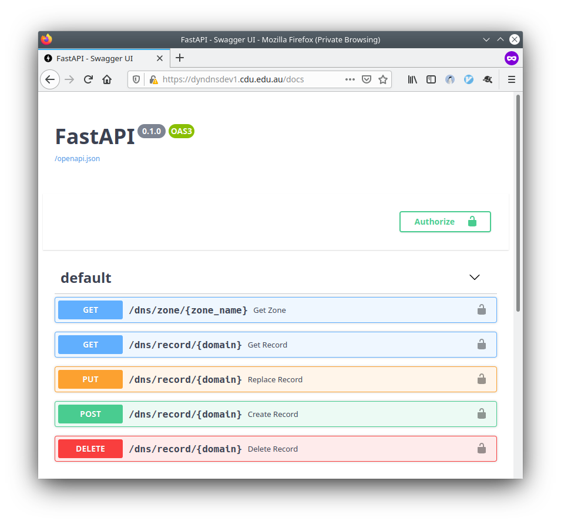
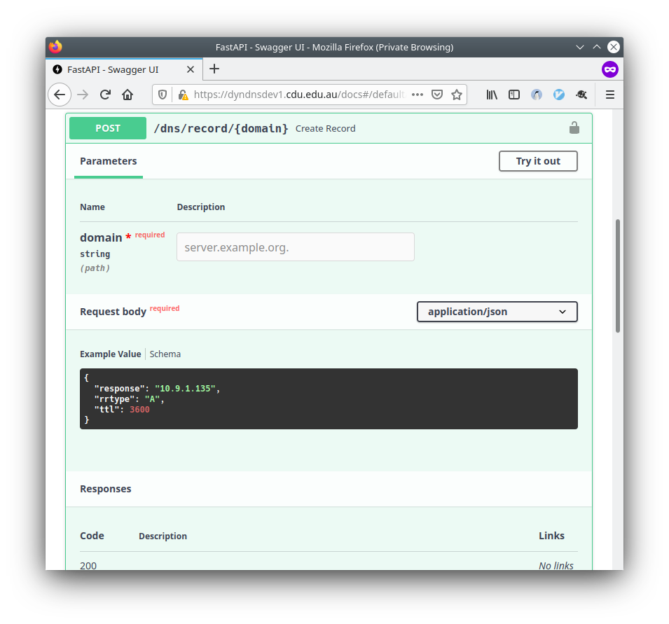

# bind-rest-api

This is a BIND API that allows the following functionality:
* dumping the zone file to JSON
* GETting a specific DNS record
* POSTing to create a new DNS record
* PUTing to replace a DNS record
* DELETEing a DNS record

This project is inspired by [https://github.com/dmyerscough/BIND-RESTful](https://github.com/dmyerscough/BIND-RESTful)

But it adds extra functionality, including:
* using [FastAPI](https://fastapi.tiangolo.com/) instead of Flask as the framwork, which allows:
  * auto-generated API docs and tooling
  * full input validation
* API Key protection (but still definitely don't expose this to the internet)
* [acme.sh](https://acme.sh) tooling to generate LetsEncrypt certificates using the API

## Auto-generated docs

By using FastAPI this project get's auto-generated Swagger-UI docs:

## Getting set up and running

* Make sure you have python 3 and [poetry](https://python-poetry.org/) installed.
* From within the folder, run `poetry install` to install all the required dependencies.
* copy the `example_config.env` and `example_apikeys.pass` files to `config.env` and `apikeys.pass`
* Customise the files and set the values you need. Make sure to generate very long api keys.
* export all the environment variables in `config.env`
* run the api with uvicorn - `uvicorn bindapi:app`

### Keys and Flow
There are two flows that need keys:

`HTTP Clients --> API` and `API --> bind9`

#### `HTTP Clients --> API`
These clients use an `X-Api-Key` HTTP header when performing requests. The API confirms that the key provided is in the `apikeys.pass` file, and then logs the friendly name for that api key.

#### `API --> bind9`
To send updates to the bind9 server the API uses a TSIG key. You put this TSIG username/password in the `config.env` file, and then also reference it in the bind9 configuration. For full details see the bind9 docs: https://bind9.readthedocs.io/en/v9_16_9/advanced.html#tsig

To test your TSIG key you can use the `nsupdate` tool: https://bind9.readthedocs.io/en/v9_16_9/manpages.html#man-nsupdate
